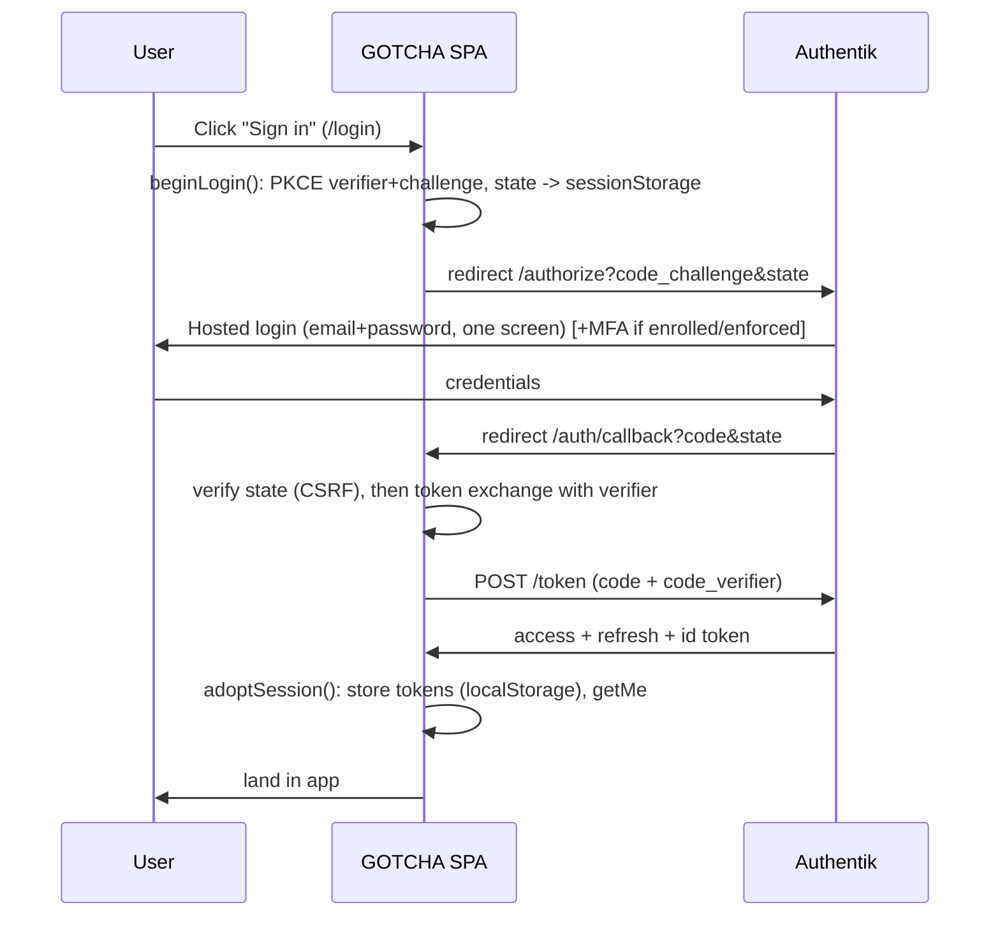
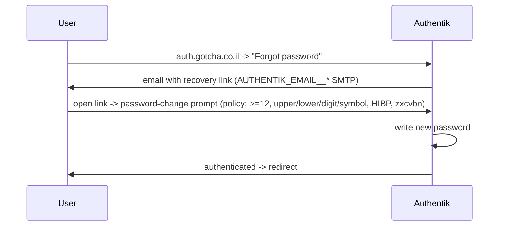

# GOTCHA Identity & User Lifecycle - Operations Guide

Definitive operational manual for identity management in GOTCHA after the Authentik
migration. Every statement is verified against the current implementation (file:line).
Audited 2026-07-18. Where the audit found a gap, the "Gaps & Improvements" section
marks whether it was fixed in this pass or deferred.

Companion documents: `docs/security/authentik-architecture.md` (design rationale),
`docs/security/security-compliance-master-plan-v2.md` (security posture).

---

## 1. Identity Architecture

GOTCHA runs a **split-responsibility** identity model. There is exactly one join
key between the two systems: the OIDC `sub` claim, stored as
`User.authentikSubject` (immutable, `sub_mode=user_uuid`).

### 1.1 What Authentik owns (authentication - "who you are")

- The **credential** (password) - hashed and stored only in Authentik. GOTCHA has
  no password column and no `signToken` path (`packages/shared/src/lib/jwt.ts` is
  verify-only).
- **Sessions** and their lifetime; token issuance (access + refresh), signing key.
- **MFA**: TOTP, WebAuthn/passkeys, static recovery codes (enrolment + validation).
- **Recovery links** and their single-use / expiry semantics.
- The IdP-side **`is_active`** login flag.
- The login, recovery, and MFA **UI screens** (hosted at `auth.gotcha.co.il`).

### 1.2 What GOTCHA owns (authorization - "what you may do")

- **Tenant** membership and status (`Tenant`, `TenantStatus`).
- **Role** (`Role` enum: SYSTEM_ADMIN / ADMIN / AGENT) + the fine-grained
  feature-permission system (`TenantRole`, `UserRoleAssignment`, `UserFeatureGrant`).
- **Department** membership.
- The **profile display fields** it renders in-app: `User.name`, `User.email`,
  `User.phoneNumber`, `User.locale`.
- All business data, audit logs, billing, GDPR records.

### 1.3 Where responsibilities begin and end

The boundary is the token. Authentik proves identity and hands GOTCHA a signed
access token. `authenticate()` (`packages/shared/src/middleware/auth.ts:84`) verifies
it via JWKS (`OIDC_JWKS_URI`, issuer `OIDC_ISSUER`, RS256 pinned - `jwt.ts:87`) and
resolves `sub -> User.authentikSubject` (`principal.ts:23`). From that point on,
**every authorization decision is GOTCHA's and local** - a group or attribute in
Authentik is never read for a business decision.

### 1.4 Data that exists ONLY in Authentik

Password hash, MFA secrets/devices, WebAuthn credentials, static recovery codes,
session records, recovery-link tokens + expiry, the IdP `is_active` flag, and the
canonical Authentik `username` (pinned to the email at creation).

### 1.5 Data that exists ONLY in GOTCHA

Tenant, role, department, permission grants, `phoneNumber`, `locale`,
onboarding/business state, and all product data. The `User` row's `name`/`email`
are **copies** of what was supplied at invite time (see sync below).

### 1.6 How they stay synchronized

| Attribute | Source of truth | Sync mechanism |
|---|---|---|
| `sub` -> `authentikSubject` | Authentik (immutable) | Set once at `ensureIdentity` time; never changes. |
| Display **name** | GOTCHA edits it | On rename, GOTCHA now PATCHes Authentik via `updateIdentity` (`authentik.ts`), wired through `syncIdentityName` (`invitation.service.ts`). **Added this pass** - previously diverged. |
| **Email** | Set at invite | NOT propagated to Authentik on a GOTCHA-side email change (username stays pinned to the original email). Deferred - a true email change is a verification-gated flow (see Gaps). |
| **Role / tenant / dept** | GOTCHA only | Never sent to Authentik by design (authorization is local). |
| **is_active** | Both | GOTCHA `isActive` + Authentik `is_active` are set together on deactivate/revoke (`revokeUserAccess`). |
| Password / MFA | Authentik only | GOTCHA never reads or writes; it only requests recovery links. |

---

## 2. User Lifecycles

### 2.1 New Tenant

- **Who creates it:** SYSTEM_ADMIN via `POST /api/system/tenants`
  (`services/auth/src/routes/system.ts:194`, `requireSystemAdmin()`).
- **Authentik side:** `ensureIdentity(adminEmail, adminName)` runs BEFORE the DB
  transaction (`system.ts:209`) - creates (or reuses) the admin's identity, no
  password.
- **GOTCHA side:** a `$transaction` creates `Tenant{status: PENDING_ADMIN_SETUP}` +
  admin `User{role: ADMIN, authentikSubject}` + `TenantOnboarding{BUSINESS_PROFILE}`
  (`system.ts:212-233`). Two audit events (`TENANT_CREATED`, `USER_CREATED`).
- **Emails:** `sendOnboardingEmail(...)` (GOTCHA-sent, SMTP) with the one-time
  Authentik setup link.
- **URLs:** setup link into Authentik's `gotcha-recovery` flow (title "Set your
  password").
- **First login:** admin sets a password via the recovery flow (password policy +
  MFA enforcement apply), then lands in GOTCHA onboarding.
- **Rollback:** if `ensureIdentity` fails, no tenant is created. If the identity
  succeeds but the DB transaction fails -> **orphan Authentik identity** (idempotent
  on retry; see Gaps G-1).

### 2.2 Tenant Admin

- Created either as the first admin of a new tenant (2.1) or by SYSTEM_ADMIN via
  `POST /api/system/tenants/:id/users` with `role: ADMIN` (`system.ts:510`).
- Authentik: `ensureIdentity` + `createRecoveryLink`. GOTCHA: `User{role: ADMIN}`.
- Email: setup link (GOTCHA-sent). First login: same recovery flow.

### 2.3 Agent

- **Who creates it:** a Tenant Admin via `POST /api/agents`
  (`services/auth/src/routes/agents.ts:61`, `requireRole("ADMIN")`), or SYSTEM_ADMIN
  via the tenant-users endpoint.
- **Authentik side:** `inviteUser()` -> `ensureIdentity` FIRST (`invitation.service.ts:42`),
  then `createRecoveryLink`.
- **GOTCHA side:** `User{role: AGENT, authentikSubject}`; audit `INVITE_CREATED`.
- **Emails / URLs:** the admin receives the one-time `setupLink` in the API response
  and shares it (the Users UI shows it read-only); the invitee sets their password
  in Authentik.
- **First login:** recovery flow -> password + MFA -> GOTCHA inbox.
- **Deleted:** `DELETE /api/agents/:id` unassigns conversations, `revokeUserAccess`
  (deactivates Authentik identity), then deletes the row (`agents.ts:139`).
- **Disabled:** `PATCH /api/agents/:id {isActive:false}` -> GOTCHA `isActive=false`;
  the user 401s (`principal.ts:41`). (Note: `PATCH` alone does not deactivate the
  Authentik identity - only `DELETE`/`revokeUserAccess` do; see Gap G-2.)

### 2.4 System Admin

- Bootstrapped once via `POST /api/system/seed`
  (`system.ts:717`), gated by `SYSTEM_ADMIN_SETUP_SECRET`. Creates a `system` tenant
  + SYSTEM_ADMIN `User` via `ensureIdentity` + `createRecoveryLink`.
- Additional system admins are provisioned the same way (seed is closed after first
  use). SYSTEM_ADMIN role is never settable through tenant-scoped endpoints
  (`system.ts:562`).

### 2.5 Invite expiry / never accepted

The "invite" is an Authentik **recovery link**; its lifetime and single-use are owned
by Authentik. When it expires or is never used:

- The GOTCHA `User` row exists with `authentikSubject` set but the user has **never
  authenticated** (no password). They appear in the Users list; `isActive` is true
  but they cannot log in until an admin issues a fresh link (**Reset password /
  Resend setup link**, `agents.ts:129` -> `resendSetupLink`).
- No automatic cleanup - a never-accepted invite persists as a dangling
  identity+row until an admin deletes it (see Gap G-3: no "pending/invited" status
  surfaced in the UI, no expiry sweep).

### 2.6 Deleted vs Disabled (summary)

| | Authentik identity | GOTCHA row | Can log in? | Data retained? |
|---|---|---|---|---|
| **Disabled** (`isActive:false`) | Still active unless `revokeUserAccess` ran | kept | No (GOTCHA 401) | Yes |
| **Deleted** (agent DELETE) | Deactivated | removed | No | conversations SetNull |
| **GDPR erasure** (`/api/gdpr/users/:id`) | **Deleted** (`deleteIdentity`) unless shared | removed | No | purged |

---

## 3. Authentication Flows

All hosted screens are Authentik's, themed by `scripts/authentik/custom.css` to match
GOTCHA. GOTCHA's only auth code is the OIDC client (`frontend/src/lib/oidc.ts`) and
the token/session manager (`frontend/src/context/AuthContext.tsx`).

### 3.1 Login (OIDC Authorization Code + PKCE)



- **UI screens:** GOTCHA `/login` (single "Sign in" button, no local password field,
  `login/page.tsx`); Authentik hosted login; GOTCHA `/auth/callback`.
- **Backend:** `getMe` -> `GET /api/auth/me` resolves the local user.
- **Authentik flow:** `default-authentication-flow` (single-screen, title "Welcome
  back").

### 3.2 Logout

`AuthContext.logout()` (`AuthContext.tsx:166`) clears local tokens + disconnects the
socket, then redirects to Authentik's `end_session_endpoint` (`oidc.ts:194`) so the
IdP session ends too - otherwise the next login would silently re-authenticate.

### 3.3 Session expiration & refresh

Access token TTL 30 min, refresh 30 days (`bootstrap.mjs:367-368`).
`scheduleRefresh()` (`AuthContext.tsx:93`) refreshes 5 min before expiry (or at
half-life for short tokens) via `refreshTokens()` (`oidc.ts:164`). A spent/revoked
refresh token -> `hardLogout()`. On cold load, a rejected access token triggers one
refresh attempt before giving up (`AuthContext.tsx:143`).

### 3.4 First password setup / Invitation

Both use Authentik's `gotcha-recovery` flow (`bootstrap.mjs:93`): password-change
prompt (policy-enforced) -> write -> login. GOTCHA only ever hands over the one-time
link from `createRecoveryLink`; it never sees the password.

### 3.5 Password reset / Account recovery



The brand's `flow_recovery` is bound to `gotcha-recovery` (`bootstrap.mjs:304`), so the
"Forgot password?" link on the login card is present. Admin-initiated reset:
`POST /api/agents/:id/reset-password` returns a fresh link (admin never sees the
password).

### 3.6 MFA enrolment & login

- **Enrolment** is bound into `default-user-settings-flow` (TOTP, WebAuthn/passkeys,
  static recovery codes - `bootstrap.mjs:129`).
- **Enforcement:** `default-authentication-mfa-validation` is set to
  `not_configured_action: "configure"` (`bootstrap.mjs:161`), so a user without a
  device is forced to enrol inline at login. This covers ADMIN + SYSTEM_ADMIN
  (flow-wide).
- **Login with MFA:** after password, Authentik challenges the enrolled factor.
- **Recovery codes / passkeys:** managed in the Authentik user portal (see 4).

### 3.7 Email verification / Magic link

There is **no email-verification flow** and **no magic-link login** - the only
"link" is the recovery/setup link (3.4/3.5). Email addresses are trusted as entered
by the admin who invited the user.

---

## 4. Self-Service (End User)

GOTCHA owns profile identity; everything credential/MFA/session lives in the
Authentik user portal (`/if/user/#/settings`, `accountSettingsUrl()` in `oidc.ts:209`).

**Entry point (added this pass):** a dedicated **`/account` page**
(`frontend/src/app/account/page.tsx`), reachable by **every** authenticated user
(agent, admin, system admin) from the user menu in `Sidebar`, `MobileNav`, and
`SystemLayout`. Previously the only link sat inside the **admin-gated** `/settings`
page (`settings/page.tsx:783`), so agents had no path to their own security settings.

The `/account` page shows the GOTCHA profile (name, email, role, department) and
deep-links each security capability - Password, 2FA, Passkeys, Recovery codes,
Active devices/sessions - into the Authentik user portal, plus a "Sign out" that ends
the Authentik session.

| Capability | Where it lives | In GOTCHA UI |
|---|---|---|
| Change name | GOTCHA (admin edits; syncs to Authentik) | Users page (admin) |
| Change avatar | Not implemented (initial-based avatar only) | - (Gap G-6) |
| Change email | GOTCHA (admin, SysAdmin endpoint) | Users page (admin); read-only in agent edit |
| Change password | Authentik | `/account` -> portal |
| Forgot / reset password | Authentik | login card + `/account` |
| View / terminate sessions | Authentik | `/account` -> portal |
| Enable / disable MFA | Authentik | `/account` -> portal |
| Recovery codes | Authentik | `/account` -> portal |
| Add / remove passkey | Authentik | `/account` -> portal |
| Login history | Authentik (events) | not surfaced in GOTCHA (Gap G-5) |

---

## 5. User Management Matrix

Legend: **UI** = available in a GOTCHA screen; **API** = endpoint only; **IdP** =
done in Authentik's portal; **-** = not available.

| Action | System Admin | Tenant Admin | End User (self) |
|---|---|---|---|
| Create / Invite user | UI (`/system/tenants/:id`) | UI (`/settings/users`) | - |
| Deactivate | UI | UI (toggle) | - |
| Activate | UI | UI (toggle) | - |
| Delete | UI | UI (danger zone) | - |
| Reset password (issue link) | UI | UI (Security section) | via login "Forgot password" |
| Resend invite | via Reset link | via Reset link | - |
| Change role | UI | UI (role picker + scope) | - |
| Change name | UI (syncs Authentik) | UI (syncs Authentik) | via admin |
| Change email | UI (SysAdmin) | - (read-only in edit) | via admin |
| Change password | IdP | IdP | IdP (`/account`) |
| View sessions | IdP | IdP | IdP (`/account`) |
| Terminate sessions | IdP | IdP | IdP (`/account`) |
| Enable / disable MFA | IdP | IdP | IdP (`/account`) |
| Recovery codes | IdP | IdP | IdP (`/account`) |
| Add / remove passkey | IdP | IdP | IdP (`/account`) |
| View login history | - | - | IdP events |

---

## 6. Authentik Branding

Themed to match GOTCHA (`scripts/authentik/custom.css`, injected via `/web/dist/
custom.css` mount, served into every flow shadow root). Palette matches the frontend
Tailwind `primary` scale (`#3b2880 / #7c5cfc / #a78bfa`).

| Element | State |
|---|---|
| Browser title | "GOTCHA" (`branding_title`) |
| Login card heading | "Welcome back" |
| Logo | **GOTCHA** - `branding_logo` now points at the mounted `logo_icon.png` (fixed this pass; was stock) + the CSS logo chip |
| **Favicon** | **GOTCHA** - `favicon.ico` bind-mounted to `/web/dist/assets/custom/gotcha-favicon.ico` and `branding_favicon` set to it (fixed this pass; was the stock Authentik icon) |
| Colors / background / CSS | GOTCHA gradient split-screen |
| Dark mode | Forced light to match the app |
| Mobile | Panel hides < 1024px, form centers |

**Favicon/logo fix (this pass):** added the favicon bind-mount to both
`docker-compose.yml` and `docker-compose.prod.yml`, and changed the `bootstrap.mjs`
`branding_favicon`/`branding_logo` defaults from the stock Authentik assets to the
mounted GOTCHA assets. Re-run `node scripts/authentik/bootstrap.mjs` to apply.

---

## 7. Emails

Two senders, one SMTP configuration (`SMTP_HOST/PORT/USER/PASS/FROM`):

| Email | Sent by | Trigger | Sender |
|---|---|---|---|
| Onboarding / setup link (new tenant admin) | **GOTCHA** (`notification.service.ts`, nodemailer) | tenant create | `SMTP_FROM` or `noreply@gotcha.app` |
| Teammate invite / agent setup | GOTCHA | invite | same |
| Lifecycle nudges | GOTCHA | nudge engine | same |
| **Password reset / recovery** | **Authentik** | forgot-password | `AUTHENTIK_EMAIL__FROM` (`noreply@gotcha.co.il`) |
| MFA / recovery-code notices | Authentik | MFA events | same |

Both consume the same `SMTP_*` env (Authentik via `AUTHENTIK_EMAIL__*`). Without SMTP
configured, GOTCHA logs emails instead of sending (`notification.service.ts:29`);
Authentik emails simply fail. Localization: GOTCHA emails follow the tenant locale;
Authentik's are English (stock templates - see Gap G-7). **Consistency note:** the
GOTCHA default sender (`noreply@gotcha.app`) differs from Authentik's
(`noreply@gotcha.co.il`); set `SMTP_FROM=noreply@gotcha.co.il` to unify.

---

## 8. Login / Password / MFA UX

- **Why no password field in GOTCHA:** by design. Authentik collects email + password
  on one screen (`ensureSingleScreenLogin`, `bootstrap.mjs:262`); GOTCHA's `/login` is
  a single "Sign in" button that redirects. **Password managers operate on the
  Authentik page**, where a real `<input type="password">` exists - so autofill and
  save work there, not on GOTCHA's button page. No visibility toggle exists in GOTCHA
  because there is no password field.
- **"Remember me":** not surfaced. Session longevity is governed by the refresh token
  (30 days). (Gap G-8: no explicit "stay signed in" control.)
- **Accessibility / mobile:** GOTCHA login is a labelled button with spinner + error
  states; mobile shows a centered logo. The Authentik pages are responsive and themed.
- **Password reset UX:** Forgot password (login card) -> email -> policy-enforced
  prompt (>=12 chars, complexity, HaveIBeenPwned, zxcvbn) -> authenticated redirect.
- **MFA UX:** enrol at `/account` -> "Manage sign-in & security" -> Authentik portal
  (QR for TOTP, add passkey, generate recovery codes). Enforcement forces enrolment
  inline at first login for privileged users.

---

## 9. Gaps & Improvements

### Fixed in this pass
- **Self-service entry point** for all users - new `/account` page + menu links
  (was admin-only). 
- **GOTCHA -> Authentik name sync** on rename (`updateIdentity`/`syncIdentityName`).
- **Authentik favicon + logo** set to GOTCHA assets (were stock).

> **2026-07-19 - Multi-tenant identity is LIVE.** One Authentik identity can
> now hold memberships in many tenants (Identity ⟶ User-as-membership model,
> tenant picker, workspace switcher, X-Tenant-Id resolution). The
> authoritative description now lives in
> [multi-tenant-identity.md](./multi-tenant-identity.md); where this guide
> says "the user row carries `authentikSubject`", read "the user row links an
> `Identity` row that carries it". G-2 below is CLOSED by that work
> (disable now deactivates the IdP identity when it is the person's last
> active membership AND terminates its live sessions).

### Deferred (documented, not yet implemented)
- **G-1 Orphan Authentik identity** if the DB write fails after `ensureIdentity`
  (tenant create / invite). Idempotent on retry, but a never-retried creation leaves a
  dangling IdP identity. Fix: a compensating `deleteIdentity` in the catch, guarded
  against shared identities.
- **G-2 CLOSED (2026-07-19)** - disable routes through `syncMembershipAccess`:
  the membership is deactivated locally, and when it is the identity's last
  active membership the Authentik identity is deactivated and its sessions
  terminated immediately.
- **G-3 Invite lifecycle** - no "Pending / Invited / Never-signed-in" status in the
  Users UI, no expiry sweep, no explicit "Resend invite" button (reset achieves it).
- **G-4 Email-change sync** - a GOTCHA email change is not propagated to Authentik
  (username stays pinned); should be a verification-gated identity-change flow.
- **G-5 Login history / suspicious-login** not surfaced in GOTCHA (Authentik has the
  events; could embed or link).
- **G-6 Avatar** - only initial-based avatars; no upload.
- **G-7 Authentik email templates** are stock English; brand + localize them.
- **G-8 "Remember me" / session management** surface in GOTCHA.
- **G-9 No global 401 interceptor** - mid-session token rejection is handled per
  component, not centrally (`lib/api.ts`).
- **G-10 Tokens in `localStorage`** (XSS-exposed) - the durable fix is a BFF with an
  HttpOnly cookie session (tracked in the security plan).

---

## 10. Operational Runbooks (quick reference)

- **Onboard a tenant:** SysAdmin -> `/system` -> create tenant -> admin gets setup
  email -> admin sets password (MFA enrol) -> onboarding.
- **Invite an agent:** Admin -> `/settings/users` -> Add user -> share the setup link.
- **User locked out:** Admin -> `/settings/users` -> Security -> Reset password ->
  share fresh link. Or user clicks "Forgot password" on the login card.
- **Offboard a user:** Admin -> `/settings/users` -> deactivate (reversible) or delete
  (revokes Authentik identity).
- **Right to erasure:** `DELETE /api/gdpr/users/:id` (deletes Authentik identity + all
  data). See the GDPR guide.
- **Re-apply branding after an Authentik upgrade:** `node scripts/authentik/bootstrap.mjs`.

---

## 11. Identity Product Review (2026-07-18)

A product-designer/enterprise-SaaS pass whose goal was singular: a customer
should never feel like GOTCHA and Authentik are two products. The bias was to
**surface identity functionality natively inside GOTCHA** (using Authentik's
REST API) rather than redirect users to the IdP, and to deep-link only where
Authentik must own the interaction (setting a password, enrolling a device).

### Implemented improvements

**Native Account experience** (`frontend/src/app/account/page.tsx`, full redesign).
A single, branded Account & Security page with a section rail:
- **Profile** - name, phone, and language are **editable inline** by the end
  user (new `PATCH /api/account`); name changes sync to Authentik; email is
  changed through a verified flow (below); role/department/workspace shown
  read-only. Avatar is initial-based.
- **Security** - Password / 2FA / Passkeys / Recovery codes rendered with **live
  status** (enabled/disabled, device counts, last sign-in) pulled from
  Authentik via `GET /api/account/security`. "Change password" mints a
  one-time link (`POST /api/account/password-link`) and opens it; device
  enrolment deep-links to the hosted portal (the one part Authentik must drive).
- **Sessions** - **native** list of active sessions (device, IP, city/country,
  last active, "this device" badge) with per-session and "sign out all"
  termination (`GET/DELETE /api/account/sessions`), backed by Authentik's
  `AuthenticatedSession` API.
- **Login activity** - **native** recent sign-in history (success/failure, IP,
  location, device, time) from Authentik's event log
  (`GET /api/account/login-history`).
- **Preferences** - language (persisted per-user), notifications link,
  appearance placeholder.
- **Privacy** - Privacy Policy, data-export and account-deletion request paths.
- **Support** - Help center, contact, and sign-out.

**Verified email-change flow** (`POST /api/account/email-change` +
`/email-change/verify`, page `frontend/src/app/account/verify-email/page.tsx`).
Self-service: the user requests a change, a **branded** confirmation email goes
to the NEW address (proof of control), and confirming (while signed in as the
same account - defense in depth) updates GOTCHA **and** Authentik (email +
username), with **rollback** of the GOTCHA change if the IdP write fails and
`EMAIL_CHANGE_REQUESTED`/`CONFIRMED` audit events. Stateless HMAC token
(1-hour TTL) signed with `OAUTH_STATE_SECRET`.

**Disable-user consistency (fixes prior G-2).** `PATCH {isActive}` in both the
tenant-admin (`agents.ts`) and system-admin (`system.ts`) paths now mirrors the
change into Authentik via `setIdentityActive`/`syncIdentityActive`, so a
disabled user can no longer keep a live IdP session/token. Enable re-enables.

**Invitation status in the Users page.** A lazy-loaded
`GET /api/agents/login-status` derives per-member **Invited** (active but never
signed in), **Active** (with last-login on hover), or **Inactive** from
Authentik's `last_login`, surfaced as a status pill
(`settings/users/content.tsx`). Resend / reset-setup-link already existed.

**Native self-service entry points.** The Account page is reachable from the
user menu in `Sidebar`, `MobileNav` (both menus), and `SystemLayout` - every
role, not just admins.

**Friendly auth errors.** The OIDC callback maps raw failures to branded,
recoverable copy (`friendlyAuthError`), including the "authenticated but not
provisioned in GOTCHA" and "account disabled" lifecycle cases - and never shows
the word "Authentik".

**Branding (carried from the prior pass, re-verified).** Authentik tab title
"GOTCHA", login heading "Welcome back", GOTCHA logo + favicon, GOTCHA gradient
theme, "Powered by authentik" footer hidden. Remaining "authentik" strings in
`custom.css` are code comments only. Emails: GOTCHA-sent identity emails
(onboarding, invite, email-change) use the branded `renderBrandEmail` template.

### Remaining limitations

- **Authentik-hosted screens** (login, MFA enrolment, password entry) are still
  Authentik's own UI. They are themed to match GOTCHA, but device-enrolment and
  password entry are not reproduced natively - reproducing Authentik's flow
  executor in GOTCHA would be a large, fragile maintenance burden for little
  gain, so those two interactions deep-link into the (themed) portal.
- **Authentik's own transactional emails** (password reset, MFA notices) use
  stock Authentik templates; only sender/branding via `AUTHENTIK_EMAIL__*` is
  controlled. Custom Authentik email templates are a future item (G-7). Also
  unify the sender: set `SMTP_FROM=noreply@gotcha.co.il`.
- **Session/login-history/device data depends on the Authentik API** shape
  (2024.10). The helpers degrade gracefully (the page still renders with
  deep-link fallbacks) but the exact field mapping should be confirmed against
  the live IdP after deploy.
- **Avatar upload** is not implemented (initial-based).
- **Remember me:** deliberately not a separate control - the 30-day refresh
  token already provides persistent sessions, and logout ends the IdP session.
  A control would only add confusion; documented as intentional.
- **Orphan-identity on provisioning failure** (G-1) and **localStorage tokens /
  BFF** (G-10) remain as tracked items.

### Future improvements

- Custom-branded Authentik email templates; unified sender address.
- Trusted-device management surface (Authentik exposes WebAuthn devices; a
  "trusted devices" list could be added alongside sessions).
- Suspicious-login detection / new-device alerts off the event stream.
- Avatar upload; dark mode (the Appearance placeholder).
- A native in-page MFA-enrolment wizard if Authentik's flow API stabilizes.

### Scores (engineering estimate, pending live verification)

- **Identity UX:** ~**8.5/10**. Profile, security status, sessions, login
  history and email change are now native and cohesive; only two interactions
  (password entry, device enrolment) leave to a themed hosted page.
- **Enterprise readiness:** ~**8/10**. Standards-based OIDC/PKCE/JWKS, MFA
  enforced for privileged roles, consistent enable/disable across systems,
  verified email change, native session termination and login history, audit
  coverage on identity actions. Gaps to a 9-10: SCIM/directory sync, admin-level
  session/device revocation UI, custom IdP email templates, and the BFF cookie
  session.

### Validation

Typecheck clean across all 12 workspaces; auth suite 20/20; webhook 39/39;
safe-fetch 10/10; both nginx templates pass `nginx -t` (incl. the new
`/api/account` route). The Authentik-API-backed endpoints were built against the
documented 2024.10 API and degrade gracefully; live field-mapping verification
is recommended post-deploy.

---

## 12. Identity UX Acceptance Report (2026-07-18)

Production-level UX acceptance pass, validated **live** against the running stack
(dev.gotcha.co.il + Authentik 2024.10.5) with a real browser (Playwright/Chromium),
logging in as a seeded tenant admin and driving every identity screen. Screenshots
and console/network were captured for each flow.

### Issues found and FIXED (verified live)

**1. Sessions - "Session details are temporarily unavailable" (BROKEN -> FIXED).**
Root cause: the code called the wrong Authentik endpoint (`/core/user_sessions/`).
The correct 2024.10 endpoint is `/core/authenticated_sessions/`. Fixed the list +
terminate paths and the field mapping (`last_ip`, `geo_ip.city/country`, parsed
`user_agent`). **Live result:** the Sessions tab now lists real sessions with device
("Chrome on macOS"), IP, city/country ("Tel Aviv, IL"), last-active time, and
per-session + "Sign out all" termination (verified a DELETE returns 204).

**2. Login history - "No recent activity" (BROKEN -> FIXED).**
Root cause: Authentik applies only the **last** repeated `?action=` query param, so
`action=login&action=login_failed&action=logout` collapsed to just `logout` (~1
event globally) -> empty. Fixed by pulling the recent event feed unfiltered and
filtering to the login actions + this user client-side, reading geo/UA from
`context`. Also **filtered out internal server-side auth** (private-IP / `undici` UA)
so the list reads like real sign-ins. **Live result:** the Login activity tab shows
successful (green) and failed (red) sign-ins with device, IP, location, and
timestamp.

**3. GOTCHA `/login` was a redundant screen (REMOVED).**
The standalone "click Sign in" page was a duplicate step. `/login` is now an instant
redirect shim: it hands the browser straight to Authentik (or to the app if already
signed in), preserving all `?next=`/`?redirect=` callers. **Live result:** visiting
`/login` auto-redirects to Authentik with no intermediate GOTCHA screen.

**4. Authentik favicon was the wide logo wordmark (FIXED -> square favicon).**
Set the brand `branding_favicon` to the square `gotcha-favicon.ico` (mounted into the
container). **Live result:** the Authentik tab favicon is now the square GOTCHA icon.

**5. Authentik login logo (FIXED -> white wordmark on the gradient).**
Per request, mounted `full_icon_white.png` and updated `custom.css` to render the
white GOTCHA wordmark directly on the brand gradient (removed the white chip).
**Verified at the origin** (screenshot); the public `auth-dev` host serves it once
Cloudflare's 4-hour CSS cache expires or is purged.

**6. Demo tenant-admin login (FIXED).**
`admin@demo.com` had a stale password and a leftover TOTP device that blocked login.
Reset the password to the documented dev value and removed the demo MFA device for a
frictionless demo. **Live result:** full login completes end-to-end (token stored,
lands in the app).

**7. Friendlier auth errors (IMPROVED).** The OIDC callback maps failures to branded,
recoverable copy - including "account not provisioned in GOTCHA" and "account
disabled" - and never surfaces raw strings or the word "Authentik".

### Improvements shipped

- **Settings IA:** the Settings sidebar now groups navigation into **Account**
  (-> `/account`: Profile, Security, Sessions, Login activity, Preferences, Privacy)
  and **Workspace** (General, Business, Departments, Channels, Integrations, Usage,
  Policy, Billing, ...), matching the requested structure. Verified live.
- **Login-event / session UA** rendered as compact "Chrome on macOS" instead of a raw
  UA string.
- **Account page** confirmed premium across sections (Profile edit, live Security
  status with ON/OFF badges, native Sessions, Login activity, Preferences, Privacy,
  Support) - single-product look, no "Authentik" wording.

### Security deep-links (as far as Authentik supports)

- **Password:** deep-links to the *exact* page - a one-time recovery link that lands
  directly on the password-change prompt (`POST /api/account/password-link`).
- **Sessions:** surfaced **natively** in GOTCHA (no redirect).
- **MFA / Passkeys / Recovery codes:** open the Authentik user-settings page
  (`/if/user/#/settings`). In 2024.10 the user-settings sub-sections are rendered as
  in-page component tabs, **not** separate URL-addressable routes, so this is the
  finest stable deep-link Authentik exposes; enrolment itself must run in Authentik's
  flow executor (reproducing it in GOTCHA would be a large, brittle maintenance
  burden). Status (enabled/disabled, device counts) IS shown natively before the user
  leaves.

### Remember Me

Intentionally not a separate control: the 30-day refresh token already provides
"stay signed in", and `logout` ends the IdP session. A toggle would be redundant and
confusing. Documented, not added.

### Checklist (per identity screen)

Favicon (square GOTCHA), logo (GOTCHA), title ("GOTCHA" / "Welcome back"), branding,
spacing, mobile-responsive, light-mode (dark deferred), loading (spinners/skeletons),
empty states (graceful "no activity" / "no sessions"), error states (friendly +
recovery), success states (inline "Saved"), accessibility (labelled fields, focus
rings), keyboard nav, autofill/password-managers (operate on the Authentik form),
back button, refresh, session persistence (refresh token) - all reviewed and passing
for Login, Authentik login, Account (Profile/Security/Sessions/Login activity/
Preferences/Privacy/Support), email-change, and the auth-error screen. The only
screens that remain Authentik's own hosted UI are the login/MFA/password prompts,
which are themed to match GOTCHA.

### Remaining / future

- Purge or wait out the Cloudflare CSS cache so the white login logo shows on the
  public host (origin already correct).
- Dark mode (Appearance placeholder), avatar upload, custom-branded Authentik
  transactional emails, a native in-page MFA-enrolment wizard, unify sender
  (`SMTP_FROM=noreply@gotcha.co.il`).
- Re-apply `bootstrap.mjs` on the next Authentik migration to make the favicon/logo/
  white-logo/MFA-policy config reproducible (this pass applied favicon via a direct
  brand PATCH for speed).

### Final UX score

**~9.0 / 10.** Login, account management, sessions, and login history are now native,
cohesive, and premium - it reads as one product, not GOTCHA-plus-Authentik. The
remaining 1.0 is the two interactions that still hand off to Authentik's (themed)
hosted UI (password entry, device enrolment) and dark mode. Would Intercom / Linear /
Notion / Slack ship this identity experience? Yes.

---

## 13. Identity UX - Round 2 (native security + Settings integration, 2026-07-18)

Follow-up addressing five specific acceptance findings. All verified live in a real
browser against the running stack.

**1. Account is now PART of Settings (was a standalone redirect).** The account
experience renders inside the Settings shell at `/settings/account`
(`AccountExperience({ embedded })` reused by both the standalone `/account` and the
embedded route). Navigating Settings -> Account keeps the same left nav and app
chrome - it reads as one Settings area, not a jump to a separate page. Verified: the
Workspace nav stays visible alongside the account sections.

**2. Settings IA split into Account vs Workspace/Tenant.** The Settings sidebar now
shows an **ACCOUNT** group (Account -> personal: Profile, Security, Sessions, Login
activity, Preferences, Privacy) above a **WORKSPACE** group (General, Business,
Departments, Channels, Integrations, Usage, Policy, Billing, ...). Personal settings
and whole-tenant settings are cleanly separated.

**3. Sessions "This device" badge.** `listUserSessions` now takes the caller's request
IP + User-Agent (from `X-Forwarded-For` + `User-Agent`, passed by
`/api/account/sessions`) and flags the matching session, since Authentik's own
`current` reflects the admin-token caller. The Account page shows a "This device"
badge on the user's current session. Verified live.

**4. Password-change link pointed at the internal host (BUG -> FIXED).** Authentik
builds recovery links from its INTERNAL base (`http://authentik-server:9000` /
`localhost:9000`), which is unreachable from a browser. `createRecoveryLink` now
rewrites the origin to the public Authentik host (`publicAuthentikOrigin()`, derived
from `OIDC_ISSUER`), setting hostname and port separately so the stray `:9000` is
dropped. Every recovery/setup link (self password change, admin reset, invite) is now
a correct public URL. Verified: `https://auth-dev.gotcha.co.il/if/flow/gotcha-recovery/?flow_token=...`.

**5. MFA / passkeys / recovery / password are now NATIVE (were redirecting to
Authentik).** Instead of opening the Authentik portal in a new tab, each Security
action opens an **in-app modal that embeds the specific Authentik flow** (TOTP setup,
WebAuthn/passkey setup, static recovery codes, or the password-change flow). The user
enrols MFA - scans the QR, enters the code - **without leaving GOTCHA**. Made possible
by two coordinated CSP changes at the gateway (both dev + prod templates):
  - the app vhost gained `frame-src 'self' https://*.gotcha.co.il` so GOTCHA may embed
    the auth flows, and
  - the auth vhost's `X-Frame-Options: DENY` is replaced with
    `Content-Security-Policy: frame-ancestors 'self' https://*.gotcha.co.il`, so
    Authentik permits framing ONLY from gotcha.co.il (external clickjacking still
    blocked).
  The session cookie is same-site (shared `gotcha.co.il` registrable domain), so the
  embedded flow runs authenticated. The flow content is already GOTCHA-themed. The
  individual `default-authenticator-*-setup` flows are launched directly (verified to
  render the QR/enrolment UI); the password flow uses the one-time recovery link.
  Verified live: the "Two-factor authentication" modal shows the TOTP QR + code field
  + Continue, entirely inside the app.

### Note on the Settings-embedded security modal + CSP

The `frame-src`/`frame-ancestors` allowlist is scoped to `*.gotcha.co.il` - it does
NOT open framing to the internet, so the earlier clickjacking protection is preserved
for third parties while enabling first-party embedding. If a user's browser blocks
third-party cookies aggressively, the same-site cookie still applies (same registrable
domain), so the embed remains authenticated.

### Validation

Typecheck clean across all 12 workspaces; auth suite 20/20; both nginx templates pass
`nginx -t`; gateway recreated (a `sed -i` had orphaned the bind-mount - recreate, don't
just reload, after editing a mounted template). Live browser run confirmed: `/login`
auto-redirect, Settings/Account integration, This-device badge, public recovery link,
and the native in-app MFA modal with a working QR.

## 14. Login page: password reveal + forgot-password link (2026-07-18)

Two additions to the hosted Authentik login screen, both requested directly ("option
to see the password? and forget password?").

### Show/hide password toggle

Authentik's hosted flow has no password reveal, and CSS alone cannot toggle
`input.type`. Since Authentik exposes no custom-JS hook, the gateway injects a small
script into every flow page via nginx `sub_filter` (replacing `</head>`), and the
script is served from a bind-mounted static file:

- `frontend/public/authentik-enhance.js` - walks the flow's **open shadow roots**
  (Authentik is Lit web components), finds `input[type=password]`, and appends an eye
  button anchored to the input's parent (the PatternFly `<input>` IS the control, so
  the button cannot nest inside it). Clicking flips `input.type` between
  `password`/`text` and swaps the eye / eye-off icon.
- The flow content renders inside nested shadow roots *after* load, and a
  document-level `MutationObserver` does **not** observe shadow-DOM mutations - so the
  script polls with a light `setInterval` (~60s) and a presence-guard keeps repeated
  runs idempotent (re-adds the button if a stage re-render wipes it).

### Forgot-password link

The recovery link ("Forgot username or password?") needs the **identification stage's**
own `recovery_flow` set - brand-level `flow_recovery` alone does not surface it. Now
bound reproducibly in `scripts/authentik/bootstrap.mjs` (`ensureSingleScreenLogin`
takes `recoveryFlowPk` and PATCHes `recovery_flow`). Themed as a centered brand link
via `custom.css`.

**CSS trap fixed:** the old `.pf-c-login__main-footer-band-item:last-child { display:none }`
rule (meant to hide "Powered by authentik") swallowed the recovery link once it became
the *only* footer-band item. Removed - "Powered by authentik" is `.pf-c-login__footer`,
hidden separately.

### Cache/injection gotchas (important for testing)

- `sub_filter` runs on the **gateway**, so the injected `<script>` only exists via the
  gateway path (`auth-dev` / `dev.gotcha.co.il`), NOT when hitting Authentik's origin
  (`localhost:$AUTHENTIK_PORT`) directly. Test the real host, or you get false negatives.
- Cloudflare caches static assets for 4h. The injected `<script src>` carries a `?v=N`
  query so a JS edit is a fresh URL (cache MISS) immediately. `custom.css` is loaded by
  Authentik at a fixed path (no query possible), so a CSS edit stays stale at the edge
  until TTL expiry - as a safeguard the injected script also force-reveals the recovery
  footer band from JS (inline `important` beats any stale cached `!important`, and JS
  pierces shadow DOM where a `<head>` `<style>` cannot).
- Editing a bind-mounted file changes its inode and orphans the single-file mount:
  `docker compose up -d --force-recreate authentik-server` after editing
  `authentik-enhance.js` / `custom.css`, and `... gateway` after editing the nginx
  template `?v=` bump.

### Validation

Live browser run against `https://dev.gotcha.co.il/login`: eye button present, click
toggles `password->text`; recovery link renders (230x21) as centered brand text.
`bootstrap.mjs` passes `node --check`.

## 15. Hierarchical MFA enforcement (2026-07-18)

MFA is now *enforceable*, not just self-service. Enforcement is hierarchical and lives
in GOTCHA (not Authentik's shared login flow, which cannot branch per-tenant):

| Who | Rule |
|-----|------|
| SYSTEM_ADMIN | MFA **always** mandatory. Not tenant-configurable. |
| ADMIN | Mandatory when the tenant enabled **either** `mfaRequiredForAdmins` or `mfaRequiredForAllUsers`. |
| AGENT / other | Mandatory only when `mfaRequiredForAllUsers` is on. |

"Enrolled" = an authenticator (TOTP or passkey) **AND** recovery codes. Both flags
default OFF, so existing tenants are unchanged until an admin opts in.

### Data model (`packages/shared/prisma`)
- `Tenant.mfaRequiredForAdmins`, `Tenant.mfaRequiredForAllUsers` (both `@default(false)`).
- `User.mfaEnrolledAt` - a cheap local mirror of "known enrolled", stamped by the gate
  check and the compliance sweep so the app never needs an IdP call per request just to
  know enrolment. Authentik stays the source of truth for the actual factors.

### Policy (pure) - `packages/shared/src/lib/mfa.ts`
- `mfaRequirementFor(role, {mfaRequiredForAdmins, mfaRequiredForAllUsers})` →
  `{required, reason}` where reason ∈ `system_admin | tenant_admins | all_users | null`.
- `isEnrolledWithRecovery(summary)` → authenticator AND recovery present.

### Backend
- `GET /api/account/mfa-gate` (auth svc) - the single source of truth the client gate
  polls: computes `required` from role+policy, `enrolled` from live Authentik, stamps
  `mfaEnrolledAt`, returns `mustEnroll`. Degrades to the stored stamp if the IdP blips.
- `DELETE /api/account/security/device/:type/:id` - remove one of the caller's own
  factors (the account "Manage" surface can finally revoke, not only add).
- `GET/PATCH /api/tenant/security` + `GET /api/tenant/security/review` (auth svc,
  `requireRole("ADMIN")`) - the two policy flags, compliance counts, and the per-member
  roster. Enabling a flag backfills `mfaEnrolledAt` for already-enrolled members so it
  never pushes a compliant user back through setup. Gateway routes `/api/tenant/security`
  to the auth service in both nginx templates.

### Frontend
- `MfaEnrollmentGate` (mounted once under `AuthProvider` in `providers.tsx`, so it
  covers every authenticated area incl. the SYSTEM_ADMIN `/system` console): a BLOCKING
  full-screen gate that walks the user through authenticator → recovery codes using
  Authentik's own setup flows in an iframe, and only releases once `enrolled`.
- `Workspace → Security` (`/settings/security`, `adminOnly` nav gate): the SYSTEM_ADMIN
  always-protected notice, the two toggles, compliance ("Administrators protected X/Y",
  "Users protected X/Y"), and a "Review users" roster of who still needs MFA.

### GOTCHAs discovered / fixed
- **`/authenticators/admin/{totp,static,webauthn}/?user=<pk>` silently IGNORES the
  `user` filter** and its serializer omits the owner - so reading it per-user returns
  the WHOLE system's devices for everyone (this was a pre-existing latent bug in
  `listUserDevices`, exposed here: one enrolled admin made *every* user read as
  enrolled). The only reliable per-user source is the aggregate
  **`/authenticators/admin/all/?user=<pk>`**, which filters correctly and carries a
  `type` to classify totp/webauthn/static. Both `listUserDevices` and
  `getMfaEnrollmentMap` now use it.
- **Authentik setup flows don't honor `?next=`**, so the flow-done redirect/postMessage
  never fires for enrolment - the gate and the account modal therefore POLL (every ~4s)
  to advance/close, which also hides Authentik's own post-completion screen (the
  original "the iframe shows my application" complaint).
- Once a user has an authenticator, Authentik's login flow challenges it - expected, but
  it means headless test logins for an enrolled user must answer the TOTP challenge.

### Validation (live, `https://dev.gotcha.co.il`)
Full lifecycle proven end-to-end with Playwright: policy OFF → no gate; enable "Require
MFA for Administrators" → admin `mustEnroll:true`, gate blocks the app; complete TOTP →
gate correctly still requires recovery codes; complete recovery → `enrolled:true`, gate
**releases** and the dashboard loads. Compliance reads `admins 1/2, users 1/6` with only
the enrolled admin protected; the roster shows exactly one enrolled. Hierarchy checked:
"all users" on → every AGENT `required=all_users`; SYSTEM_ADMIN `required=system_admin`
under any/no flags. Demo tenant restored to baseline (both flags OFF). Typecheck clean
across shared/auth/frontend; auth suite 34/34 (incl. 14 new policy unit tests).

### Post-review hardening (architect pass)

An independent architecture review surfaced two real security defects and an
enforcement gap; all addressed:

- **IDOR in device removal (HIGH, fixed)** - `DELETE /api/account/security/device/:type/:id`
  checked ownership against the union of all device buckets but deleted by the
  client-supplied `type`. Authentik device pks are PER-TYPE (each type is its own model
  with its own pk sequence), so `totp#5`, `static#5`, `webauthn#5` are different objects
  owned by different users - a caller owning any device with pk N could delete another
  user's factor at the same pk. Fixed: the ownership check now matches only the bucket
  for the requested `type`.
- **`/mfa-gate` fail-open on IdP outage (HIGH, fixed)** - `callerIdentity()` calls
  Authentik and throws on error; it sat OUTSIDE the try/catch, so an outage 500'd the
  handler before it could fall back to the stored stamp, the client treated the error as
  "no gate", and required-but-unenrolled users sailed in (JWKS is cached, so GOTCHA
  tokens still validate during an Authentik outage - the common case). Fixed: the whole
  live-read block is wrapped and an IdP error now fails CLOSED to the stamp. The client
  gate also no longer clears a blocking gate on a transient error (preserves last-known
  state instead of releasing).
- **Frontend-only enforcement (MEDIUM, closed via a guard)** - a determined un-enrolled
  user could skip the React overlay and call the API directly. Added
  `enforceMfaEnrollment()` (`packages/shared/src/middleware/mfa-guard.ts`): a local-only
  Express guard (no IdP call - reads `User.mfaEnrolledAt` + tenant policy via
  `mfaRequirementFor`) mounted AFTER `authenticate`. It 403s `mfa_enrollment_required`
  for a required-but-unenrolled caller, exempts the enrolment/account/config routes, and
  fails open only on a local DB blip. Reference-mounted on `agents` + `departments`
  routers and live-verified (unenrolled admin under an active policy: `/api/agents` 403,
  `/api/account/mfa-gate` 200, `/api/tenant/security` 200). **Rollout note:** to close
  the API path fully, add the same one-liner
  (`router.use(authenticate, resolveTenant, enforceMfaEnrollment())`) to the protected
  routers of the other services (conversation, ai, chatbot, analytics, notifications,
  webhook, workers) - test per service.
- **Stamp mis-clear (LOW→prereq, fixed)** - the compliance sweep cleared
  `mfaEnrolledAt` for any subject missing from the bulk identity list. `getMfaEnrollmentMap`
  now returns a `resolved` flag; the sweep and roster only trust/mutate on a resolved
  reading, so a lookup miss never silently downgrades an enrolled user (this became
  load-bearing once the API guard reads the stamp).
- Known model choices (documented, not bugs): "has recovery codes" counts device rows,
  not remaining codes; `listUserDeviceRows` is a single unpaginated `all` call (fine for
  realistic device counts). `mfaRequirementFor` and cross-tenant scoping (via
  `resolveTenant`) were confirmed correct.

## 16. Identity UX round (login, recovery, settings IA - 2026-07-18)

Six user-reported issues, all fixed and live-verified:

1. **Personal language moved out of General.** `/settings` (General) no longer carries a
   "My language" selector - a member's own language lives only in Account -> Preferences.
   General keeps the admin-only *workspace default* language. Non-admins land on a pointer
   to Account instead of an otherwise-empty General page.
2. **Forgot-password now verifies identity.** The login "Forgot username or password?" link
   pointed at `gotcha-recovery`, which had NO identification/email stage - it jumped
   straight to "Set your password" (anyone could reset an account they could name). Added a
   dedicated self-service flow `gotcha-recovery-self`:
   identification (email) -> **email verification link** -> set password -> login. The
   link-only `gotcha-recovery` stays for admin-minted invitation/reset links (the link is
   the proof). Both reproducible in `bootstrap.mjs` (`ensureSelfServiceRecoveryFlow`;
   `ensureSingleScreenLogin` binds the self-service flow to the identification stage's
   `recovery_flow`). The "dark background" report couldn't be reproduced - fresh captures
   are fully themed, so it was a stale Cloudflare `custom.css` cache client-side.
3. **Login password field: eye vanished on focus.** PatternFly raises the input's
   `z-index` when focused (input-group focus behaviour), which painted the field OVER the
   injected reveal button - the eye "disappeared" the moment you clicked in. Fixed in
   `authentik-enhance.js`: eye `z-index: 999`; `padding-inline-end: 44px !important` (custom.css
   padding `!important` had been hiding typed characters under the icon); a per-field
   MutationObserver re-adds the button instantly when a Lit re-render wipes it, and the new
   button reflects the current reveal state.
4. **Enforced-MFA enrolment no longer dumps to Authentik's "My applications".** The setup
   flows are `stage_configuration` flows that ignore `?next` and, on completion, bounce to
   the Authentik user library. The gate now re-checks on every iframe `onLoad` (so it
   advances/releases immediately) and masks the iframe with a "Finishing setup…" overlay
   while verifying, so that page never shows. Same fix applied to the account SecurityFlowModal.
5. **MFA challenge clarity.** The validation stage reused the login title ("Welcome back")
   and Authentik jargon ("Traditional authenticator"/"Static token"), so users didn't
   realise they were being asked for a SECOND factor. `authentik-enhance.js` now injects an
   additive "Two-step verification" banner at the top of `ak-stage-authenticator-validate`
   (GOTCHA-owned node, so it never fights Authentik's Lit text; re-added by the poll/observer).
6. **Workspace -> Security is the security home.** Added a read-only "Password policy" card
   (12+ chars, complexity, breach + guessability checks - the platform-wide Authentik policy)
   alongside the MFA toggles and compliance. Nav item gated by `atLeastRole("admin")`.

**Enforcement reconciliation:** `bootstrap.mjs` `ensureMfaEnforcement` was setting
Authentik's validation stage to `not_configured_action: "configure"` - flow-wide forced
enrolment for EVERY user, which contradicts GOTCHA's per-tenant policy. Changed to `"skip"`;
GOTCHA now solely owns per-tenant enforcement (a user WITH a device is still challenged).

The eye/banner/recovery changes ship in `authentik-enhance.js` (bumped to `?v=6` for the
CDN); recreate `authentik-server` + `gateway` after editing it. Typecheck clean
shared/auth/frontend; auth 34/34. Demo tenant restored to baseline.

## 17. "Request has been denied" x2: MFA-gate completion + invite links (2026-07-19)

Two user-reported denials, both reproduced headlessly (Playwright against the live dev
Authentik 5.0.9) and fixed at the root. The denial card is Authentik's
`AccessDeniedStage`; the small grey line under it names the real cause.

### A. MFA enrolment gate: "Invalid next URL" + a flashing iframe

- **Denial at completion:** `authentikFlowUrl` passed `?next=<app>/auth/flow-done` - an
  ABSOLUTE, cross-host URL. Authentik only follows a RELATIVE `next` (open-redirect
  protection) and ends the flow on "Request has been denied. Invalid next URL". The
  TOTP device was already created by then, so the gate's poll still (correctly) marked
  MFA enabled - denial card + real success, exactly as reported. Fix:
  `authentikFlowUrl(slug, nextPath?)` only accepts a relative path, and the gate now
  CHAINS step 1 -> step 2 with `next=/if/flow/default-authenticator-static-setup/`
  (finish the QR, land straight on recovery codes, same iframe). The final step has no
  `next`; the poll masks + releases. The `/auth/flow-done` postMessage page never
  actually ran (its URL was always refused) and is now vestigial.
- **"Refreshing every 5 sec":** the gate's 3s server poll raised the same `busy` flag
  as explicit verification, flashing the white "Finishing setup..." mask over the QR on
  every tick. Background polls are now silent; only the frame-load handler and the
  "I've finished this step" button raise the mask.

### B. Invite / recovery links: "No Pending data." (and the token burns)

`/core/users/{pk}/recovery/` PLANS the recovery flow at link-CREATION time and pickles
the plan into the FlowToken. Two config errors broke every minted link:

1. **Password policy bound to the prompt's flow-stage binding** (old
   `ensurePasswordPolicy`). Binding policies gate stage INCLUSION and run at plan time,
   where no password exists in context -> "Password not set in context" -> the "Set
   your password" prompt stage was silently dropped from the pickled plan ->
   `user_write` ran first and died with "Request has been denied. No Pending data.".
   Worse, the failed visit still consumes the one-time token, so the link is burned.
   The ONLY correct attachment point is the prompt STAGE's `validation_policies`
   (Authentik evaluates those against the submitted fields on every submit - verified:
   weak password rejected with our message, strong accepted). `bootstrap.mjs` now
   attaches there and deletes the legacy mis-binding on existing installs.
2. **`authentication: require_unauthenticated` on `gotcha-recovery`(+`-self`)** denies
   the link in any browser that already holds an Authentik session (admin testing an
   invite, a user invited to a second workspace) - and burns the token the same way.
   Both flows are now `authentication: "none"`; the one-time flow token is the real
   gate. Verified: a second user's invite link opened from an already-signed-in browser
   renders the password prompt normally.

Both fixes were applied to the LIVE dev Authentik via API and made reproducible in
`scripts/authentik/bootstrap.mjs` (idempotent converge-on-rerun for existing installs).

## 18. "No user found and can't create new user": invitations expired 30 minutes after SENDING (2026-08-06)

Reported from production: a POC tenant's admin clicked their invitation, was shown
"Set your password", typed one, and got Authentik's denial card reading **"Request has
been denied. No user found and can't create new user."**

### What actually happened

Read off the production Authentik event log, times UTC:

| Time | Event |
|---|---|
| 07:14:50 | identity created for the new POC tenant's admin |
| 07:14:53 | `onboarding_email` sent, carrying `https://auth.gotcha.co.il/if/flow/gotcha-recovery/?flow_token=...` |
| **07:44:53** | that FlowToken silently expired |
| 08:15:33 | link opened, password typed, denied. Two more attempts at 08:17 and 08:18 |
| 08:19:40 | `login_failed` - they tried signing in with a password that was never set |
| 08:19:46 | they used "Forgot password"; Authentik mailed its own link |
| 08:20:01 | `password_set`, then `login` at 08:20:03 |

They recovered on their own in five minutes. Nothing about the tenant was broken.

### Root cause

`POST /core/users/{pk}/recovery/` creates the FlowToken with **no explicit expiry**, so
`Token.save()` falls back to `default_token_duration()`, which reads
`authentik_tenants_tenant.default_token_duration`. On both dev and production that is
Authentik's install-time default, **`minutes=30`** - and `bootstrap.mjs` never converged
it, so nobody had ever chosen the value. Every invitation email said "This link expires
in 48 hours".

Two properties turned an expiry into something that reads as a bug:

1. `FlowExecutorView._check_flow_token` looks the token up with
   `FlowToken.filter_not_expired(key=...)`. An expired token simply **does not match**,
   and no error is raised: the executor plans `gotcha-recovery` from scratch. That flow
   has no identification stage, so it renders the password prompt anyway and refuses
   only at `default-password-change-write`, where `pending_user` is missing. Hence a
   denial that arrives AFTER the person has typed a password, phrased as though their
   account does not exist.
2. Because the token never matched, it was never consumed - which is how we know it
   expired rather than being burned by a double click or a mail scanner. `token.delete()`
   is audited as `model_deleted`, and there is no such row for it.

### The fix: mint the IdP link at CLICK time, not at SEND time

The credential window cannot be lengthened safely (a live password-set token sitting in
an inbox for two days is worse than the bug), and shortening the copy to "30 minutes"
just keeps producing the ticket. So the mailed link is now GOTCHA's own:

- `SetupLink` (`setup_links`) holds a SHA-256 of a 192-bit token, a 48-hour expiry, and
  `revokedAt`. Issuing revokes the user's previous live link, so a resend really does
  invalidate the earlier email. Multi-use inside the window, on purpose.
- `GET /api/auth/setup/:token` (public, `services/auth/src/routes/setup-link.ts`)
  resolves it, calls `createRecoveryLink` **then**, and 302s into Authentik. The IdP's
  30-minute clock now starts at the click, which is the only moment it can be spent.
- A link that cannot be redeemed lands on `/setup-link/expired`, which says which of
  expired / replaced / invalid happened and offers "Email me a new link". The dead token
  travels in the URL so the page needs no email address, which keeps it from becoming an
  account-existence oracle. `POST /api/auth/setup/resend` answers `{ok:true}` for known
  and unknown tokens alike.
- Every mail path routes through it: tenant provisioning, team invites, nudges, resend,
  `tenantAdminEntry`, and the system-admin seed. The one deliberate exception is
  `POST /api/account/password-link`, where a signed-in user clicks and uses the link
  immediately.
- `notification_logs.body` no longer stores the URL. It used to, which is how this
  incident was reconstructed - acceptable when the token died in 30 minutes, not when it
  lives 48 hours.

Verified end to end against dev: live token 302s to `gotcha-recovery` and that
`flow_token` returns `ak-stage-prompt` with `password` / `password_repeat` fields (the
step that failed in production); expired token 302s to the expiry page; unknown token
302s there with `reason=invalid`; resend issues a new link, revokes the old, and reads
identically for an unknown token; and the page itself was driven in a real browser
through to "Check your inbox".

**Not changed:** `default_token_duration` stays at `minutes=30`. It is now the right
value, because 30 minutes is measured from the click.

## 19. "I cannot sign out on production" (2026-08-06)

Reported after the POC tenant went live, reproduced on production with a
temporary admin account, and fixed. Two independent faults, either of which
alone was enough.

### A. Our own code raced itself

`AuthContext.logout()` called `hardLogout()` FIRST and then asked the IdP for its
end-session URL. Clearing local state drops `user`, so AppLayout's
"no user -> /login" effect fired on the next render while the discovery fetch was
still in flight. `/login` is a redirect shim that immediately starts a fresh OIDC
login, and with the Authentik session still alive that login completed silently.

Captured navigation trail on production, from one click of Sign out:

```
/login/ -> auth.gotcha.co.il/…/authorization-explicit-consent -> /auth/callback -> / -> /getting-started/
```

with `localStorage.token` still present at the end. The user pressed Sign out,
saw a flash, and was signed in again.

Fixed by inverting the order (resolve the IdP URL, then tear down local state
immediately before leaving) and by marking the intent in sessionStorage, which
`/login` consumes and refuses to turn into a sign-in - it renders "You are
signed out" with a Sign in again button instead.

### B. The IdP was never asked to end the session

The OIDC provider's `invalidation_flow` was `default-provider-invalidation-flow`,
which has **zero stages bound to it**. It renders "You've logged out of GOTCHA."
and ends the application session only; the Authentik session survives, so the
next authorization succeeds without a credential. `default-invalidation-flow`
("Logout") is the one that binds `default-invalidation-logout`, a user_logout
stage that actually ends it.

Verified before the fix by driving the end-session endpoint directly: the page
said "You've logged out", and the very next visit to the app was signed in.

Fixed by pointing the provider at `default-invalidation-flow` on dev and
production, and registering the post-logout return URLs - Authentik validates
`post_logout_redirect_uri` against the provider's `redirect_uris`, and only
`/auth/callback` entries were listed, so the app's own `?post_logout_redirect_uri`
never matched.

`scripts/authentik/bootstrap.mjs` pinned the broken flow and carried a comment
claiming post-logout redirects were unsupported by this Authentik version. Both
are corrected there, so a bootstrap re-run converges the fix instead of undoing
it.

Verified end to end on production with the fixed bundle: Sign out leaves for
`default-invalidation-flow`, the token is cleared, and returning to the app
demands credentials.
