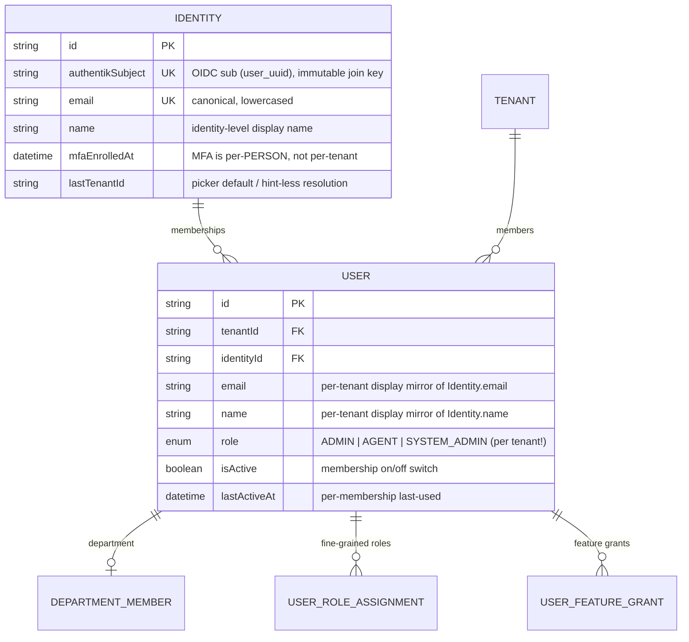
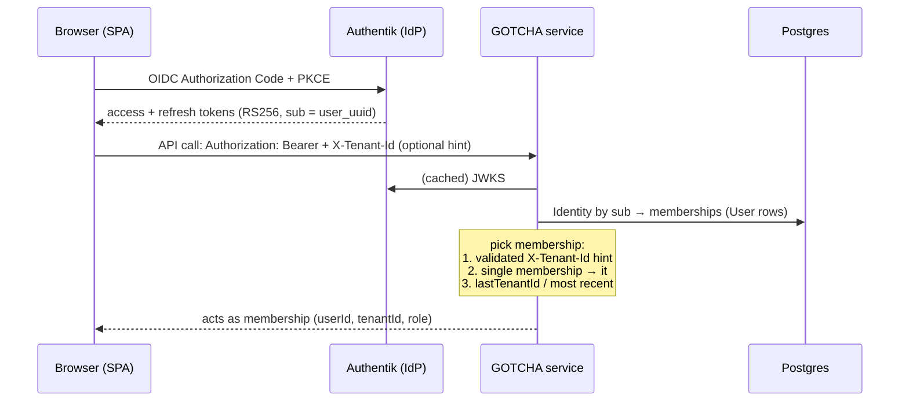

# Multi-Tenant Identity & Membership Architecture

> Status: **LIVE** (2026-07-19). Supersedes the single-tenant identity binding
> described in earlier revisions of `identity-operations-guide.md`.
> Authentik remains the ONLY identity provider; GOTCHA remains the ONLY
> source of truth for memberships, tenants, roles, departments, permissions,
> and subscriptions.

## 1. The model

One **person** (an Authentik identity) can belong to **unlimited tenants**,
with a different role, department, permissions, and feature flags in each.

Key invariants:

- `Identity.authentikSubject` is globally unique - one row per person.
- `@@unique(tenantId, identityId)` - one membership per person per tenant.
- `@@unique(tenantId, email)` - unchanged; emails stay unique inside a tenant.
- **Everything business-scoped hangs off the MEMBERSHIP (`User`) row**:
  conversations, department membership, RBAC assignments, feature grants,
  locale, phone. Nothing business-scoped touches `Identity`.
- `Identity` holds only person-level truth: the OIDC subject, canonical
  email/name, and the MFA-enrolment mirror (enrolling once satisfies every
  workspace - MFA lives in Authentik, per person).
- `User.email/name` are **display mirrors** synced from `Identity` by the
  profile-rename and email-change flows. `Identity` is the master.

## 2. Authentication flow (unchanged trust boundaries)

`resolvePrincipal(token, tenantHint)` in `packages/shared/src/lib/principal.ts`
is the single definition of "who is this caller". Rules:

1. **The `X-Tenant-Id` header is a HINT, never an authorization.** It is
   validated against the identity's memberships; naming a tenant the person
   has no active membership in yields **403 `tenant_denied`** (a disabled
   membership yields 401 `inactive`).
2. No hint + one membership → that membership. Every pre-existing
   single-tenant API consumer works unchanged, no header required.
3. No hint + several memberships → the identity's last-used tenant, falling
   back to the most recently active membership.
4. `lastActiveAt` / `lastTenantId` are stamped (throttled to 5 minutes,
   fire-and-forget) so "last used" ordering and defaults follow the person.

WebSocket handshakes take the same hint: socket.io `auth.tenantId`
(conversation service) and `?tenant=` on `/ws` (notifications service).

Internal service-to-service auth is untouched: shared secret +
`x-tenant-id` names the acting tenant scope (see `middleware/auth.ts`).

## 3. Login & tenant selection UX

- **Single-tenant identity** (the overwhelmingly common case): logs in,
  lands in their tenant. Nothing changed.
- **Multi-tenant identity, first login**: the app is gated by a full-screen
  **tenant picker** (`frontend/src/components/TenantPicker.tsx`) - tenant
  avatar, name, per-tenant role, "last used", search when > 6.
- The choice is remembered: `localStorage.activeTenantId` (client) +
  `Identity.lastTenantId` (server). Subsequent logins drop straight into the
  last workspace.
- **Switching**: the workspace switcher (sidebar, above the user card -
  `WorkspaceSwitcher` in `Sidebar.tsx`) lists every membership. A switch:
  1. `POST /api/auth/me/switch-tenant` - server validates the membership and
     stamps last-used (audited as `user.tenant_switched`);
  2. stores the new `activeTenantId`;
  3. full reload - deliberately, so permissions, entitlements, departments,
     branding, billing context, and AI configuration all rebuild against the
     new tenant with zero chance of stale cross-tenant state. No re-login:
     the Authentik session identifies the person, not the tenant.
- Header plumbing is a single fetch interceptor
  (`frontend/src/lib/active-tenant.ts`): every same-origin `/api/*` request
  carries `X-Tenant-Id`; a `tenant_denied` response self-heals by clearing
  the stored selection and reloading.

## 4. Invitations across tenants

`inviteUser` (`services/auth/src/services/invitation.service.ts`):

- Fresh email → Authentik identity + local `Identity` + membership; the
  invitee gets a one-time password-setup link (unchanged).
- **Email already belonging to an identity in another tenant** → a NEW
  MEMBERSHIP is attached to the existing identity (`existingIdentity: true`,
  `setupLink: null` when they have already signed in - no phishing-shaped
  "set your password" mail for an existing user; they just sign in and pick
  the workspace).
- Same person, same tenant, twice → refused
  (`This person is already a member of this tenant`).

## 5. Disable / revoke semantics

Disable = the MEMBERSHIP's `isActive=false`, effective on the next request
(principal resolution refuses inactive memberships).

IdP consequences are **last-membership-aware** (`syncMembershipAccess` /
`revokeUserAccess`):

- Person still active in another tenant → the Authentik identity stays
  active (they must keep signing in elsewhere); the disabled tenant is
  unreachable regardless.
- This was their LAST active membership → the Authentik identity is
  deactivated **and every live IdP session is terminated immediately** - an
  open browser tab dies now, not at token expiry.

Delete-user and GDPR erasure follow the same rule: the Authentik identity
and the local `Identity` row are removed only when the last membership goes
(user erasure deletes both; tenant erasure collects orphaned identities and
removes them after the tenant cascade).

## 6. Sessions, Remember Me

- The Account page (`/account` → Sessions) lists Authentik sessions
  (browser/OS, IP, city/country, last-active, "This device" badge), with
  per-session sign-out, **"Sign out other sessions"** (server keeps the
  caller's session; `?includeCurrent=1` for a true global sign-out), and
  refresh. All via the Authentik admin API, scoped to the caller's identity.
- **Remember Me** is Authentik-native and env-configured in
  `scripts/authentik/bootstrap.mjs` (`ensureSessionPolicy`):
  - `AUTHENTIK_SESSION_DURATION` - base IdP session (default `seconds=0` =
    browser session);
  - `AUTHENTIK_REMEMBER_ME_OFFSET` - extra lifetime when the user ticks
    "Stay signed in" (non-zero also renders the checkbox; default `days=30`);
  - `AUTHENTIK_ACCESS_TOKEN_VALIDITY` / `AUTHENTIK_REFRESH_TOKEN_VALIDITY` -
    token lifetimes (defaults `minutes=30` / `days=30`).

## 7. Retention scheduling

`services/ai/src/services/retention-purge.service.ts` now RUNS on its own:

- Repeatable BullMQ job, cron from `RETENTION_PURGE_CRON` (default
  `30 3 * * *`), kill-switch `RETENTION_PURGE_ENABLED=false`.
- Executes every enabled per-tenant `DataRetentionPolicy` row, including the
  previously-skipped categories `billing_webhook_events` and
  `reasoner_shadow_evals`.
- Platform defaults via env for tenants with no policy of their own:
  `RETENTION_DEFAULT_MESSAGES_DAYS`, `RETENTION_DEFAULT_USAGE_LOGS_DAYS`,
  `RETENTION_DEFAULT_AUDIT_LOGS_DAYS`,
  `RETENTION_DEFAULT_BILLING_WEBHOOK_EVENTS_DAYS`,
  `RETENTION_DEFAULT_REASONER_SHADOW_EVALS_DAYS` (unset = no limit).
- Every purge writes a `retention.purge_ran` audit event; manual trigger
  remains at `POST /api/gdpr-internal/run-retention-purge`.

## 8. Authorization direction

Role checks continue migrating to permission keys (enforcement layer =
permissions; role = convenience grouping):

- User lifecycle routes (`/api/agents` invite/update/reset/delete,
  login-status) → `requirePermission("settings:members:manage")`.
- Workspace security policy (`/api/tenant-security`) →
  `requirePermission("settings:workspace:update")`.
- Billing routes were already permission-gated. `requireRole` remains only
  where no catalog key models the surface yet.

## 9. Migration

`packages/shared/prisma/migrations/20260719120000_identity_membership_model/`:

1. Guards abort loudly on ambiguous data (one email ↔ two subjects; duplicate
   case-variant emails inside a tenant).
2. Creates `identities`; backfills ONE identity per `lower(email)` carrying
   the subject, newest name, max MFA stamp, and last tenant.
3. Adds `users.identity_id` (backfilled, NOT NULL, FK-cascade) +
   `users.last_active_at`, and the `(tenant_id, identity_id)` unique.
4. Drops `users.authentik_subject` and `users.mfa_enrolled_at`.

Fully automatic; existing tenants, users, and Authentik links continue
working with no manual steps. Rollback = restore from backup (the migration
is destructive on the two dropped columns, which is why the guards fail
closed).

## 10. API summary

| Endpoint | Purpose |
|---|---|
| `GET /api/auth/me` | profile + tenantName + **memberships[]** |
| `GET /api/auth/me/memberships` | memberships + lastTenantId (picker) |
| `POST /api/auth/me/switch-tenant` | validate + stamp a workspace switch |
| `DELETE /api/account/sessions` | sign out other sessions (`?includeCurrent=1` = all) |
| header `X-Tenant-Id` | active-tenant hint on every API call |
| ws `auth.tenantId` / `?tenant=` | same hint for sockets |
