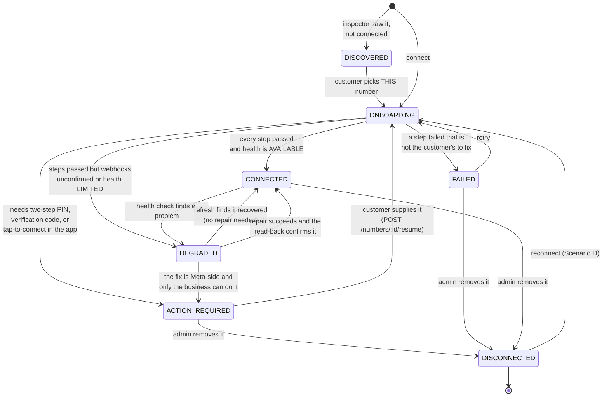
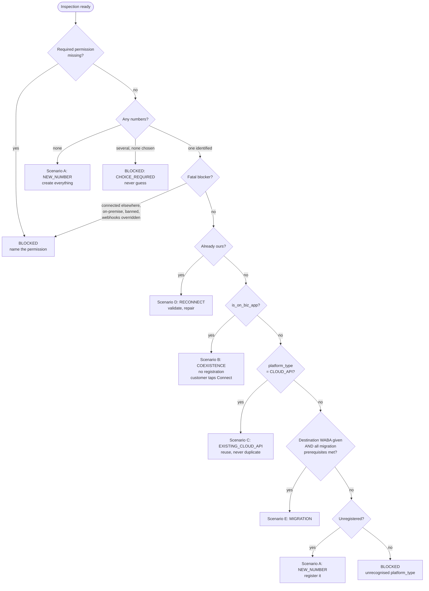

# WhatsApp Multi-Number Architecture

How GOTCHA connects, operates and repairs WhatsApp numbers. Companion to
[01-meta-api-inventory.md](./01-meta-api-inventory.md) (what Meta allows) and
[02-permissions-review.md](./02-permissions-review.md) (what we ask for).

---

## 1. The one idea

**The unit of work is a phone number, not a WhatsApp account.**

Everything else follows. The previous implementation's unit of work was the
WABA: `POST /connect/whatsapp` fetched every number under the customer's WABA
and rewrote all of them on every connect. That made four of this project's
requirements unreachable, not hard:

| Requirement | Why a WABA-shaped unit of work breaks it |
|---|---|
| Adding a number must not interrupt existing ones | Adding one rewrote them all |
| Repairing one must not affect others | Repair had no per-number target |
| Disconnecting one must not affect others | Unsubscribing at WABA level silences siblings |
| Each number has its own lifecycle | There was one status for the whole batch |

So the redesign is not primarily new features. It is a change of granularity,
and the features fall out of it.

---

## 2. Layers

```
frontend/src/app/channels/whatsapp/        Phases 5, 6, 8
  content.tsx                              connect, manage, diagnose, repair
        |  HTTPS, tenant-scoped
        v
services/auth/src/routes/whatsapp-numbers.ts        Phase 8
  /inspect  /connect  /numbers/:id/{resume,refresh,repair}  DELETE
        |
        v
services/auth/src/services/whatsapp/
  onboarding.service.ts     Phase 9   idempotent per-number step pipeline
  health.service.ts         Phase 10  per-number health, repair, disconnect
        |
        v
packages/shared/src/whatsapp/            no database, no writes, pure
  meta-client.ts     official Graph endpoints, structured errors
  inspector.ts       Phase 3   read-only sweep -> diagnostic model
  flow-selector.ts   Phase 4   pure decision over that model
  meta-types.ts      Meta's shapes, open unions
        |
        v
                    Meta Graph API v24.0
```

The dependency arrow never reverses. `packages/shared/src/whatsapp` has no
Prisma import and no `process.env` read beyond the Graph version, which is what
makes the flow selector unit-testable without a Meta account or a database. All
33 flow-selection tests run in milliseconds against fixtures.

### Why the inspector is database-free

`inspectMetaAssets` needs to know which numbers GOTCHA already owns, to
distinguish "yours", "another workspace's" and "nobody's". Rather than query
inside, it takes `knownNumbers: Map<phoneNumberId, tenantId>` from the caller.
The route supplies it. Testing supplies a literal. That single inversion keeps
the whole decision layer pure.

---

## 3. Data model

```
ChannelAccount (existing, untouched)
  channel = WHATSAPP
  externalId = <PHONE_NUMBER_ID>      one row per number, already
  credentials = encrypted { accessToken, wabaId, phoneNumber }
        |
        | 1:1
        v
WhatsAppNumber                        NEW: the lifecycle
  businessPortfolioId, wabaId, phoneNumberId
  platformType, isOnBizApp            the two flow-deciding facts
  onboardingFlow, state, pendingAction
  messagingStatus, codeVerificationStatus, nameStatus,
  qualityRating, throughputLevel, messagingLimitTier
  webhookSubscribed, webhookVerifiedAt, webhookOverrideUri
  healthSnapshot, canSendMessage, lastHealthCheck, lastError
        |
        | 1:N
        v
WhatsAppNumberEvent                   NEW: append-only audit
  step, outcome, metaErrorCode, message, detail, durationMs
```

### Three decisions worth defending

**A satellite table rather than a replacement.** Conversations, templates, the
send adapters and the inbound router all key off `ChannelAccount`. Forking the
messaging core to add onboarding state would risk the working part of the
system to improve the broken part. `ChannelAccount` already gave one row per
number; what it lacked was anywhere to put a lifecycle.

**A table rather than more `platformMeta` JSON.** "Which numbers need
attention" and "which are waiting on the customer" must each be one indexed
query. A lifecycle you cannot index or constrain is not a lifecycle.
`whatsapp_numbers(tenant_id, state)` is the management screen's primary query.

**Tokens duplicated per number, deliberately.** Numbers on one WABA share a
business token, so storing it per number is redundant. It is also the only way
revoking one number cannot reach another's ability to send. Isolation beats
normalisation here, and the cost is one encrypted blob per number.

### Open string columns, not enums

`platformType`, `messagingStatus`, `qualityRating`, `canSendMessage` and the
rest are `TEXT`, not Postgres enums. Meta documents members without publishing
a complete enumeration and adds to them without notice. A Prisma enum would
turn "Meta shipped a new quality rating" into a crash on the customer's channel
page. `KnownOr<T>` in `meta-types.ts` keeps autocomplete without closing the
set.

---

## 4. The connect sequence

```mermaid
sequenceDiagram
    autonumber
    actor C as Customer
    participant UI as /channels/whatsapp
    participant API as auth: whatsapp-numbers
    participant R as Redis
    participant INS as Inspector (shared)
    participant SEL as Flow selector (shared)
    participant PIPE as Onboarding pipeline
    participant M as Meta Graph v24.0
    participant DB as Postgres

    C->>UI: Connect WhatsApp
    UI->>M: FB.login(config_id, response_type=code)
    M-->>UI: WA_EMBEDDED_SIGNUP { business_id, waba_id(s) }
    M-->>UI: authorization code

    UI->>API: POST /inspect { code, business_id, waba_ids }
    API->>M: GET /oauth/access_token
    M-->>API: business token
    Note over API,R: Token is stored server-side, never returned.<br/>The code is single-use, so it cannot be<br/>exchanged again at connect time.
    API->>R: SET wa_signup:<tenant>:<sessionId> (TTL 15m)

    API->>INS: inspect(client, hints, knownNumbers)
    INS->>M: GET /debug_token (granular_scopes)
    INS->>M: GET /<portfolio>/owned_whatsapp_business_accounts
    INS->>M: GET /<portfolio>/client_whatsapp_business_accounts
    loop each WABA
        INS->>M: GET /<WABA_ID> (review, verification, funding)
        INS->>M: GET /<WABA_ID>/subscribed_apps
        INS->>M: GET /<WABA_ID>/phone_numbers (platform_type, is_on_biz_app)
        INS->>M: GET /<id>?fields=health_status
    end
    INS-->>API: MetaInspection (numbers, blockers, degraded)

    loop each number
        API->>SEL: selectFlow(inspection, number)
        SEL-->>API: scenario + customer message + steps
    end
    API-->>UI: { sessionId, candidates[] }

    C->>UI: "Connect this one" on ONE number
    UI->>API: POST /connect { sessionId, phoneNumberId }
    API->>R: GET wa_signup:<tenant>:<sessionId>
    API->>PIPE: inspectDecideOnboard(one number)

    Note over PIPE,DB: Persist BEFORE any Meta write, so a crash<br/>mid-pipeline still leaves a repairable record.
    PIPE->>DB: upsert ChannelAccount + WhatsAppNumber (state=ONBOARDING)

    PIPE->>M: POST /<WABA_ID>/subscribed_apps
    PIPE->>M: GET /<WABA_ID>/subscribed_apps
    Note over PIPE,M: Read back. A 200 on POST means Meta accepted<br/>the request; only presence in the list proves<br/>inbound messages will arrive.

    alt Scenario A or E, number not registered
        PIPE->>M: POST /<PHONE_NUMBER_ID>/register { pin }
    else Scenario B (Coexistence) or C (already Cloud API)
        Note over PIPE: Skipped. Meta: "skip the phone number<br/>registration step, as the number is already<br/>registered." Calling it spends one of ten<br/>allowed calls per 72 hours for nothing.
    end

    PIPE->>M: GET /<PHONE_NUMBER_ID> (profile refresh)
    PIPE->>M: GET /<PHONE_NUMBER_ID>?fields=health_status
    PIPE->>DB: state = CONNECTED | DEGRADED | ACTION_REQUIRED | FAILED
    PIPE->>DB: WhatsAppNumberEvent per step
    API-->>UI: state + per-number health report
```

Note what the diagram does not contain: any loop over the customer's other
numbers.

---

## 5. Number lifecycle state machine



### Why `ACTION_REQUIRED` is not `FAILED`

Waiting on a two-step PIN is not a fault. Meta publishes no endpoint to read,
reset or disable that PIN, so asking is the only correct behaviour. Labelling
it an error sends the customer hunting for a technical problem that does not
exist, and hides the one action that would actually resolve it. The UI says
"Needs you".

### Why `DEGRADED` exists at all

The previous implementation had two outcomes: `CONNECTED` or an error. So a
number whose webhook subscription failed was written as `CONNECTED` on one code
path, and the customer had a channel that could send and would never receive.
`DEGRADED` is the state for "connected, and something specific is wrong", with
the specifics in `healthSnapshot`.

---

## 6. Flow selection



### The ordering that matters

**B is tested before C.** A Coexistence number is *also* `platform_type:
CLOUD_API`; the two are distinguished only by `is_on_biz_app`. Testing the
Cloud API branch first would route every WhatsApp Business app customer into a
flow that ignores their app, tries to register an already-registered number,
and asks for a PIN they do not need. There is a test pinning this ordering.

**Unknown blocks rather than guesses.** If Meta ships a `platform_type` this
build has not seen, the selector returns `BLOCKED` and says so. A guess here
writes real state against a customer's number.

**A single unmet migration prerequisite hides the option entirely.** Meta lists
seven mandatory conditions (inventory 9.1). `evaluateMigration` checks all
seven and returns `null` on any failure. A migration that fails halfway leaves
the number verified against a WABA it no longer belongs to, which is worse than
never starting.

---

## 6a. The two-path entry, and why a wrong guess is recoverable

Meta forces the onboarding flow to be chosen **before** authorization:

| Path | Launch |
|---|---|
| WhatsApp Business app (Coexistence) | `extras.featureType = "whatsapp_business_app_onboarding"` |
| New or existing Cloud API number | standard Embedded Signup, no `featureType` |

And the field that reveals which was right, `is_on_biz_app`, is only readable
through a `<PHONE_NUMBER_ID>` we can access, which exists only **after**
authorization. There is no Meta API that answers "is this arbitrary number on
the WhatsApp Business app" beforehand, and there could not be: it would be a
phone-number enumeration oracle.

So the customer picks, in one plain-language question about their own business,
and some of them pick wrong. `packages/shared/src/whatsapp/path-fallback.ts`
makes that recoverable rather than terminal:

```
evaluatePathOutcome(path, candidates) -> { eligibleCount, switchTo, reason }
```

| Situation | reason | switchTo |
|---|---|---|
| Meta returned nothing | `NO_CANDIDATES` | the other path |
| Business app flow, nothing is on the Business app | `NO_BUSINESS_APP_NUMBER` | `new` |
| Everything found is already this workspace's | `ALL_ALREADY_CONNECTED` | none |
| Everything found has its own blocker | `ALL_BLOCKED` | none |
| Something is connectable | `OK` | none |

Two rules encoded here:

**Never a bare empty state.** Every outcome carries a reason the UI renders as
a specific sentence. `switchTo` drives a one-click relaunch.

**Never a pointless relaunch.** `switchTo` is null whenever the other path
would reach the same numbers. A relaunch costs a full re-authorization;
offering one that cannot help is worse than explaining the situation.

### The counter-intuitive eligibility rule

Under the **standard** path a number with `is_on_biz_app: true` stays
**eligible**. If it surfaced there at all it is already on Cloud API, so it was
onboarded to Coexistence at some earlier point, and the flow selector routes it
to `COEXISTENCE` and skips registration. Excluding it would block a perfectly
good connection. A Business app number *not* yet on Cloud API never appears in
that flow, so the signal we act on is its **absence**, not its presence.

This was wrong in the first implementation and the test caught it.

### Session lifecycle across a relaunch

A relaunch is a new `FB.login`, so a new single-use authorization code and a new
business token. `startSignupSession` therefore **destroys the tenant's previous
session** before publishing the new one
(`services/auth/src/services/whatsapp/signup-session.ts`). Leaving it alive
would let a stale `sessionId` - from a picker still open on screen - connect
numbers under a grant the customer walked away from, and switching paths is
exactly when the granted assets change.

---

## 7. Isolation: how one number is kept from touching another

This is the requirement most easily claimed and least easily proved. Four
mechanisms, each at a different layer:

**1. The query, not the check.** Every per-number route filters on
`{ id, tenantId }` in the `where` clause rather than fetching by id and
verifying ownership afterwards. Cross-tenant access is impossible rather than
guarded against.

**2. `phoneNumberId` is required on connect.** Not optional with a fallback.
The old route's optional-with-fallback shape is exactly what let it connect
everything.

**3. The pipeline takes one number.** `onboardNumber` has no list parameter.
There is no code path that iterates numbers.

**4. Disconnect checks for siblings before unsubscribing.** This is the
non-obvious one, and the reason it is worth writing down:

> **Meta subscribes webhooks per WABA, not per number.**

So the obvious "unsubscribe on disconnect" would silence every *other* number
the tenant has on that WABA. It is invisible in testing unless a tenant happens
to have two numbers on one account, and it is catastrophic when it happens.
`disconnectNumber` counts live siblings first and leaves the subscription in
place when any remain. The number is disconnected on our side alone, which is
correct: with no `ChannelAccount` row, the router discards its inbound.

Related: `subscribeApp` during repair is *additive*, and subscribing an
already-subscribed app is a no-op at Meta. So repairing one number cannot
disturb a sibling that is already working.

### What disconnect deliberately does NOT do

It never calls `deregister`. Deregistration throws away the number's Cloud API
registration, and re-registering demands the two-step PIN again. That is a
destructive, hard-to-reverse act, and it belongs to a customer decision, not to
clicking Remove.

---

## 8. Honesty rules encoded in the system

Each of these replaces a specific way the old implementation misled.

| Rule | Where enforced | What it replaces |
|---|---|---|
| Webhook subscription is read back, never assumed from a 200 | `subscribeWebhooks`, `refreshNumberHealth` | POST success alone marked the channel CONNECTED |
| The registration PIN is the customer's and is asked for | `register(phoneNumberId, pin)` signature makes it mandatory | Hardcoded `pin: "000000"`, failure logged as a "note" |
| Registration is skipped where Meta says to skip it | `registerNumber` early returns for Coexistence and Cloud API | Every number was sent to `/register` |
| Rate limit 133016 stops rather than retries | `registerNumber` | Blind retry burned the customer's 10-per-72-hours budget |
| Meta's `possible_solution` is shown verbatim | `blockersFromHealth`, `CheckRow` | Nothing read `health_status` at all |
| What could not be checked is reported | `degraded`, `degradedReasons`, `missingPermissions` | A narrower sweep looked like a complete one |
| The state is derived from evidence at the end | `onboardNumber` final settle, `refreshNumberHealth` re-derive | Status was written optimistically up front |
| One token exchange, pinned | `MetaWhatsAppClient.exchangeCode` | Four speculative attempts, one on a hardcoded v25.0 |
| All granted WABAs are read, not just the first | `grantedTargets` returns the array | `target_ids[0]`, the origin of the single-number assumption |

---

## 9. Security notes

**The business token never reaches the browser.** `/inspect` exchanges the code
server-side and stores the token in Redis under
`wa_signup:<tenantId>:<sessionId>` with a 15-minute TTL, returning only an
opaque `sessionId`. The key is tenant-scoped, so a leaked session id cannot be
replayed against another workspace.

This also fixes a correctness bug that a browser-held-token design would hide:
an Embedded Signup authorization code is **single-use**. Exchanging it once to
inspect and again to connect fails on the second call.

**The session is intentionally reusable within its TTL.** A customer who
authorised once and has three numbers adds all three without re-authorising per
number. That is the difference between multi-number setup feeling like one task
and like three.

**Audit bodies are redacted before storage.** `MetaApiError.redactedBody()`
strips any key matching `token|secret|pin|password|credential` before the
response is written to `WhatsAppNumberEvent.detail`, so the detail panel is
safe to render and safe to hand to support.

---

## 10. Compliance

Every Meta interaction in this feature is an official, documented Graph API
call, listed with its source URL in
[01-meta-api-inventory.md](./01-meta-api-inventory.md). Specifically absent:

- no browser or headless automation
- no reverse-engineered or undocumented endpoints
- no WhatsApp Web
- no scraping of any Meta surface

The one browser-side Meta interaction is `FB.login` from Meta's own JavaScript
SDK, which is the documented way to launch Embedded Signup.

### Dated obligation

**Embedded Signup v2 is deprecated on 2026-10-15.** The migration to v4 is a
Facebook Login for Business *configuration* change, not a code change, which is
why `EmbeddedSignupEvent` is typed as an open union and the frontend handler
tolerates unknown `event` values rather than switching on a fixed list. See
[02-permissions-review.md](./02-permissions-review.md) section 7.
